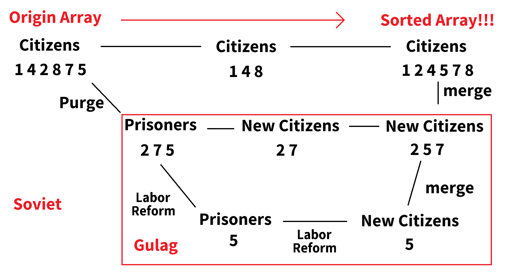

# Welcome to the Stalin Merge Sort repo

# What is the Stalin Sort
### Introduction
This is a AMAZING sorting algorithm that can always sort an array in O(n) performance.

Here is the origin repo [Stalin Sort](https://github.com/gustavo-depaula/stalin-sort).

# Then what is the Stalin Merge Sort
### Introduction
It is a sorting algorithm that combines [Stalin Sort](https://github.com/gustavo-depaula/stalin-sort), Merge Sort and Socialism.

### How it works
It is simple in theory and politics.  
Just  
-> Purge your citizens  
-> send to the Gulag  
-> LaborReform them  
-> merge those who are reformed back to the origin citizens  
-> keep 2, 3 step util there are no more prisoners in Gulag  
-> now you have a sorted array  
-> AMAZING!!!


### More detail
So there is a country call Union of Soviet Socialist Republics.
```cpp
class UnionofSovietSocialistRepublics
```
There are many citizens in this country.
```cpp
FlexibleArray citizens
```
There is also a Gulag prison within this country.
```cpp
class Gulag
```
You can call the function StalinMergeSort to sort the citizens.
```cpp
UnionofSovietSocialistRepublics.StalinMergeSort()
```
It will Purge the citizens of this country. Yes, Purge by the Stalin Sort.
```cpp
UnionofSovietSocialistRepublics.Purge()
```
After Purge, the government will send those who were Purged to the Gulag. And implementing the LaborReform. Yes, also LaborReform by the Stalin Sort.
```cpp
gulag.LaborReform();
```
After once LaborReform, bring those who experienced the reformes back to the society and become your New Citizens.
```cpp
UnionofSovietSocialistRepublics.AcceptNewCitizens();
```
Repeat this process multiple times. Until there are no more prisoners in the Gulag.
```cpp
void StalinMergeSort() {
    Purge();
    while (gulag.Population() > 0) {
        gulag.LaborReform();
        AcceptNewCitizens();
    }
}
```
AMAZING, you have a sorted array now.

# References and Acknowledgements
This project references the [Stalin Sort repo](https://github.com/gustavo-depaula/stalin-sort).